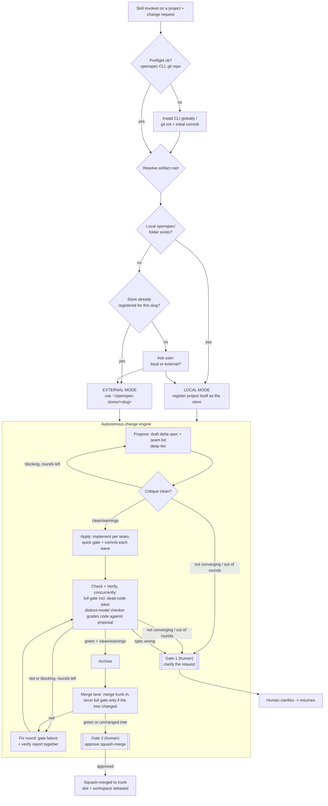

# openspec-orchestrator


A [Claude Code](https://claude.com/claude-code) skill for spec-driven development on top
of [OpenSpec](https://github.com/Fission-AI/OpenSpec): draft a delta spec, critique it,
implement it, gate and verify it, archive it into the living spec. Execution is
autonomous end to end, with two defined human checkpoints.

This repository is the engine (`SKILL.md`, `AUTONOMOUS-ORCHESTRATION.md`, `scripts/`), not
a target project. It is applied, by the skill, to whichever project it is invoked on.

## Overview

- **Discipline.** No application code changes before a delta spec proposal exists and has
  passed critique. Implementation maps 1:1 to the finalized proposal, tests land with it,
  and a full gate — including a dead-code pass — runs before anything is archived.
- **Routing.** Determines where OpenSpec artifacts (proposals, specs, tasks) live for a
  given project:
  - a project with a local `openspec/` folder uses it (**local mode**);
  - a project with neither a local folder nor a registered store gets an **external
    store** under `~/openspec-stores/<slug>/`, leaving the project's directory and git
    history untouched by OpenSpec;
  - a project with neither is asked once, at first invocation.

  Local mode takes priority over an existing external store for the same project. See
  [SKILL.md § Step 1](SKILL.md).
- **Execution.** Autonomous: Propose → Apply → Check → Verify → Archive → Merge, end to
  end, with at most two human checkpoints per change (see flowchart). There is no
  step-by-step mode.

## Architecture



## Repository layout

| Path | Contents |
|---|---|
| [`SKILL.md`](SKILL.md) | Skill definition: preflight, root resolution, the 3-phase workflow, guardrails. |
| [`AUTONOMOUS-ORCHESTRATION.md`](AUTONOMOUS-ORCHESTRATION.md) | Operational rules for the autonomous run: phases, slots, dispatch groups, checker loops, model/effort routing, bug triage, initiatives. |
| [`scripts/run-change`](scripts/run-change) | Mechanical engine: slots, workspaces/worktrees, gates, merge lane, state and session-log bookkeeping. |
| [`scripts/lib.sh`](scripts/lib.sh) | Shared helpers: store/registry lookups, state-file format, model routing, project-skill stage mapping, local-vs-external guard. |
| [`tests/run.sh`](tests/run.sh) | Black-box tests for `run-change`, via its CLI only. |
| [`CONTEXT.md`](CONTEXT.md) | Domain glossary: Store, Change, Worker, Advisor, Blackboard, Seam list, etc. |
| [`docs/proposals/`](docs/proposals/) | Design records for engine extensions. Adopted proposals reference where they landed; others are marked as sketches. |
| `openspec/`, `.openspec-store/` | This repository's own OpenSpec scaffold, used to develop the skill under its own discipline. Not required by a target project. |

## Installation

### Prerequisites

- [Claude Code](https://claude.com/claude-code).
- The `openspec` CLI on `PATH`: `npm i -g openspec`. The skill installs/upgrades this
  globally when missing; never as a project dependency.
- A target project must be a git repository. If it isn't, the skill runs `git init` and an
  initial commit before proceeding.

### Install the skill

`SKILL.md` and `AUTONOMOUS-ORCHESTRATION.md` invoke `scripts/run-change` as a path
relative to the skill's own directory; `scripts/lib.sh` locates its sibling files the same
way. The full repository — at minimum `SKILL.md`, `AUTONOMOUS-ORCHESTRATION.md`, and
`scripts/` — must be present in that layout wherever Claude Code loads skills from.
Symlinking the repository keeps it current with `git pull`:

```bash
ln -s "$(pwd)" ~/.claude/skills/openspec-orchestrator
```

A plain copy works as well; it requires re-copying after updates.

## Usage

Invoke from inside, or pointed at, a target project:

```
/openspec-orchestrator add rate limiting to the /login endpoint
```

For read-only discovery with no artifacts written:

```
/sdd:explore how should we approach rate limiting?
```

### Execution sequence

1. **Routing** — resolves local mode, external-store mode, or prompts once. Recomputed
   from repo state on every invocation; not cached. See [SKILL.md § Step 1](SKILL.md).
2. **Autonomous run** — Propose (with critique) → Apply → Check + Verify (concurrent) →
   Archive → Merge lane, with fix rounds and tier escalation handled automatically. No
   approval between phases. The merge lane reruns the full gate only when merging trunk
   changed the tree the gate already passed on.
3. **Gate 1** (conditional) — raised if critique or Verify cannot converge, or the request
   is ambiguous. Requires clarification before the change resumes.
4. **Gate 2** (once, at completion) — diffstat, gate log, and verify report presented for
   squash-merge approval.

A request scoped to a single phase (e.g. "just draft the proposal") is still treated as
the full change; there is no partial-run mode. Stopping early leaves the change `blocked`.

### Local vs. external mode

| | Local mode | External mode |
|---|---|---|
| Applies when | Project has (or the user chose) `openspec/` in the project | Project has neither, or a store is already registered |
| Artifact location | `<project>/openspec/` | `~/openspec-stores/<slug>/openspec/` |
| Project git history | Includes artifacts | Untouched by OpenSpec |
| Registration | Project registered as the store (`openspec store setup <slug> --path <project> --no-init-git`) | Separate directory registered as the store, with its own git history |
| Config location | `<project>/openspec/config.yaml` | `~/openspec-stores/<slug>/openspec/config.yaml` |

`openspec store remove` must not be run on a local-mode store: its `local_path` is the
project root, and `--yes` deletes project files.

### Configuration

Orchestration settings live only in the resolved root's `openspec/config.yaml`:

```yaml
orchestration:
  concurrency: 2                     # max concurrent changes for this project
  gate_quick: "npm run lint && npm run typecheck"
  gate_full: "npm test && npx knip"  # must include a dead-code pass
  model_mechanical: claude-haiku-4-5-20251001   # optional overrides
  model_standard: claude-sonnet-5
  model_deep: claude-opus-5
  stage_skills:                      # optional — route to the project's own skills
    plan: project-spec-drafter       # replaces the default drafter
    critic: [project-code-review]    # runs in addition to the default checker
    test: [project-test-skill]       # runs in addition to the default checker
```

`model_*` are optional; unset tiers fall back to the default tier→model table
(`scripts/run-change model get`). `stage_skills` is optional: `plan` accepts at most one
skill and replaces the deep-tier drafter when set; `critic`/`test` accept a list and stack
on top of the built-in checker. See
[`docs/proposals/skill-stage-mapping.md`](docs/proposals/skill-stage-mapping.md).

### Tests

```bash
bash tests/run.sh
```

Exercises `scripts/run-change` against a temporary registry and git origin/clone: slots,
workspaces, gates, merge lane, the local-vs-external guard, `stage-skills get`, and state
transitions. All three scripts must also pass `bash -n`.

## Guardrails

- `openspec init` is never run in a target project, in either mode.
- No writes under a project root beyond OpenSpec artifacts, `.openspec-store/store.yaml`
  (local mode), and a `git init` plus initial commit when missing.
- Local mode takes priority over an existing external store for the same project; the
  bypassed store is left untouched.
- Every OpenSpec CLI call carries `--store <slug>` once a root is resolved.

Full list: [SKILL.md § Guardrails](SKILL.md).
