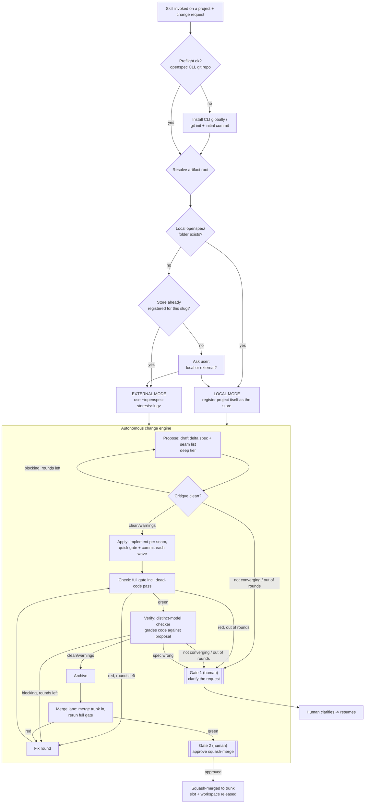

# openspec-orchestrator

A [Claude Code skill](https://claude.com/claude-code) that drives spec-driven
development on top of [OpenSpec](https://github.com/Fission-AI/OpenSpec):
propose a delta spec, get it critiqued, implement it, gate and verify it, then
archive it into the living spec — **before any application code changes**,
and end-to-end with no manual step-by-step mode.

This repo is the **engine**, not a target project. It ships once
(`SKILL.md`, `AUTONOMOUS-ORCHESTRATION.md`, `scripts/`) and is applied, by
the skill, to whichever project you invoke it on.

## What this is

Two halves:

- **The discipline** — never write, modify, or delete application code
  before a delta spec proposal exists and has passed critique. Implementation
  maps 1:1 to the finalized proposal, tests land with it, and a full gate
  (including a dead-code pass) runs before anything is archived.
- **The routing** — deciding *where* OpenSpec artifacts (proposals, specs,
  tasks) live for a given project:
  - a project that already has a local `openspec/` folder keeps using it
    (**local mode**);
  - a project with neither a local folder nor a registered store gets an
    **external store** under `~/openspec-stores/<slug>/`, keeping the
    project's own directory and git history untouched by OpenSpec;
  - a project with neither yet is asked, once, which it wants.

Local always takes priority over an external store if both exist for the
same project — see [SKILL.md § Step 1](SKILL.md) for the exact algorithm.

Execution is **always autonomous**: invoking the skill on a change runs
Propose → Apply → Check → Verify → Archive → Merge end to end, asking a
human only twice at most per change (see the flowchart below), never for
routine "should I continue?" approval between phases.

## How it fits together



## Repo layout

| Path | What it is |
|---|---|
| [`SKILL.md`](SKILL.md) | The skill definition Claude Code loads — preflight, root-resolution, the 3-phase workflow, guardrails. Read this first for *what* runs. |
| [`AUTONOMOUS-ORCHESTRATION.md`](AUTONOMOUS-ORCHESTRATION.md) | The detailed rulebook for *how* a change is driven autonomously: phases, slots, dispatch groups, checker loops, model/effort routing, bug triage, initiatives. Written for the agent running it, not a human reader. |
| [`scripts/run-change`](scripts/run-change) | The mechanical "none-tier" engine: slots, workspaces/worktrees, gates, merge lane, state and session-log bookkeeping. Does not propose, implement, fix, or verify — that's the agent's job. |
| [`scripts/lib.sh`](scripts/lib.sh) | Shared helpers `run-change` sources: store/registry lookups, state-file dialect, model routing, the local-vs-external guard. |
| [`tests/run.sh`](tests/run.sh) | Black-box tests for `run-change`, driven only through its CLI. |
| [`CONTEXT.md`](CONTEXT.md) | Domain glossary — Store, Change, Worker, Advisor, Blackboard, Seam list, etc. |
| `openspec/`, `.openspec-store/` | This repo's *own* OpenSpec scaffold (for developing the skill itself under its own discipline) — not something a target project needs. |

## How to use

### 1. Prerequisites

- [Claude Code](https://claude.com/claude-code).
- The `openspec` CLI on `PATH`: `npm i -g openspec`. The skill offers to
  install/upgrade this globally itself if it's missing — never as a
  dependency of your project.
- Your target project should be a git repo (if it isn't, the skill runs
  `git init` and an initial commit for you before doing anything else —
  the one write it makes under a project root beyond OpenSpec artifacts).

### 2. Install the skill

Copy (or symlink) this repo's `SKILL.md` and `AUTONOMOUS-ORCHESTRATION.md`
into a skill directory Claude Code loads, e.g.:

```bash
mkdir -p ~/.claude/skills/openspec-orchestrator
cp SKILL.md AUTONOMOUS-ORCHESTRATION.md ~/.claude/skills/openspec-orchestrator/
```

### 3. Invoke it

From inside (or pointed at) your target project, ask Claude Code to make a
change under spec control — the skill triggers automatically on that kind
of request, or invoke it by name:

```
/openspec-orchestrator add rate limiting to the /login endpoint
```

For read-only discovery before you're ready to commit to a change (no
artifacts written), use the sibling command instead:

```
/sdd:explore how should we approach rate limiting?
```

### 4. What happens next

1. **Routing** — the skill resolves whether this project uses local mode,
   external-store mode, or asks you which (see the flowchart above and
   [SKILL.md § Step 1](SKILL.md)). This happens once per invocation, from
   repo state — nothing is cached, so it's recomputed correctly even if you
   later add or remove a local `openspec/` folder.
2. **The full autonomous run** — Propose (with critique) → Apply → Check
   (gate) → Verify → Archive → Merge lane, with fix rounds and tier
   escalation handled automatically. You are not asked between phases.
3. **Gate 1** (only if something's wrong before code is trusted) — the spec
   critique or the Verify checker couldn't converge, or the request itself
   is ambiguous. You get the report and clarify; the change resumes from
   there.
4. **Gate 2** (once, at the end) — the change is green and ready. You get a
   diffstat, the gate log, and the verify report, and approve the
   squash-merge onto trunk.

If you ask for "just the proposal" or "only apply," that's still treated as
the whole change — there is no manual step-by-step mode to fall back to. If
you genuinely want to stop early, say so; the change is left `blocked`.

### 5. Local vs. external mode, in practice

| | Local mode | External mode |
|---|---|---|
| When | Project already has (or you chose) `openspec/` in the project | Project has neither, or a store was already registered |
| Artifacts live in | `<project>/openspec/` | `~/openspec-stores/<slug>/openspec/` |
| Project git history | Artifacts are part of it | Untouched by OpenSpec |
| How it's wired | The project itself is registered as the store (`openspec store setup <slug> --path <project> --no-init-git`) | A separate directory is registered as the store (git-backed, its own history) |
| Config (`orchestration.*`, gates, models) | `<project>/openspec/config.yaml` | `~/openspec-stores/<slug>/openspec/config.yaml` |

Never run `openspec store remove` on a local-mode store — its `local_path`
*is* the project root, so `--yes` would delete project files.

### 6. Running the test suite

```bash
bash tests/run.sh
```

Exercises `scripts/run-change` end to end against a temp registry and a
temp git origin/clone — slots, workspaces, gates, merge lane, the
local-vs-external guard, and state transitions. All three scripts are also
expected to pass `bash -n` (parse-checked) before behavior tests run.

### 7. Configuring a project

Per-project orchestration settings live only in the resolved root's
`openspec/config.yaml` (local or external, per the table above), never in
the target project's other files:

```yaml
orchestration:
  concurrency: 2                     # max concurrent changes for this project
  gate_quick: "npm run lint && npm run typecheck"
  gate_full: "npm test && npx knip"  # must include a dead-code pass
  model_mechanical: claude-haiku-4-5-20251001   # optional overrides
  model_standard: claude-sonnet-5
  model_deep: claude-opus-5
```

`model_*` are optional — unset tiers fall back to the engine's default
tier→model table (`scripts/run-change model get`).

## Guardrails at a glance

- Never runs `openspec init` in a project, in either mode.
- Never writes under a project root beyond OpenSpec artifacts themselves,
  `.openspec-store/store.yaml` (local mode), and — only when missing — a
  `git init` plus initial commit.
- Local mode always wins over an existing external store for the same
  project; the bypassed store is never touched.
- Every OpenSpec CLI call carries `--store <slug>` once a root is resolved.

Full details: [SKILL.md § Guardrails](SKILL.md).
