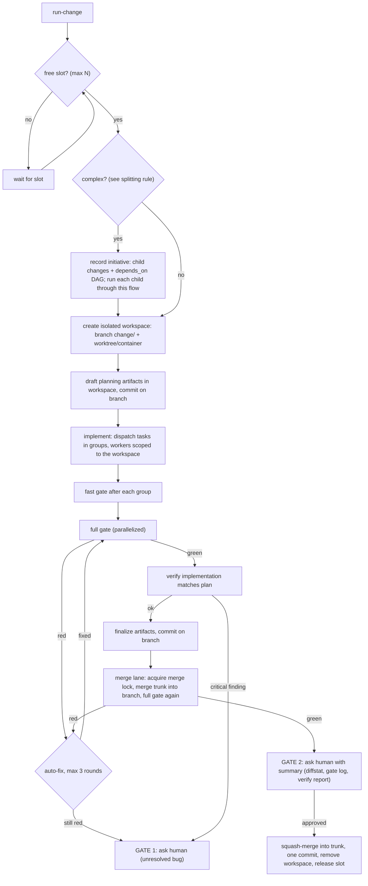

# Autonomous change-run orchestration (generic pattern)

An example design for turning a propose/apply/archive-style change workflow
into an autonomous, resumable, per-change lifecycle. Adapt names, tools and
specialist roles to the target repo; the structure is what matters.

## Goal

Each unit of work ("a change") runs on its own branch in its own isolated
workspace, a fast gate runs between steps, at most N changes run concurrently
through a single serialized merge lane, and a human is asked at most twice:
once when an error survives repeated auto-fix attempts, and once before the
final merge into the trunk branch.

## Preconditions to measure before designing

- Current gate runtime and whether it parallelizes (test count, slow steps).
- Whether isolated workspaces (git worktrees, containers, etc.) are cheap to
  create and sync dependencies into.
- Which paths must never be touched outside a designated subdirectory
  (protected inputs, secrets, generated-and-committed files).
- Existing approval/permission policy, so gates don't duplicate it.

## Target lifecycle

Everything between the boxes is autonomous. Commits on `change/<name>` never
ask. Squash-merge produces one commit per change on the trunk, without a
history rewrite that a permission policy might block.

## 1. Speed

- Parallelize the test runner (e.g. `-n auto` style workers) after confirming
  no shared-state tests break under parallel execution; pin the ones that do
  to a serial mode rather than dropping parallelism everywhere.
- Split the gate script into cheap steps (lint, type check, spec/schema
  validation, static checks) that run concurrently with the test run via
  background jobs, keeping "every step runs, report all failures" semantics.
- Add a `--quick` gate mode (lint, type check, last-failed tests, falling back
  to the full suite when there's no cache) for use between dispatch groups.
  The full gate stays mandatory before verify and before merge.

## 2. Isolated workspaces

- One script to create/remove/list a workspace per change: branch
  `change/<name>` from trunk, worktree (or equivalent) at a workspace root,
  symlink or otherwise expose any protected/read-only input directories,
  sync dependencies, and claim a slot file. Refuse when all slots are taken.
- Fix any validation script that assumes a real directory rather than a
  symlink (e.g. `find` needs `-H` to follow a symlinked root).
- Add the workspace root to version-control ignore rules.
- Workers (subagents/scripts) always receive the workspace path explicitly
  and operate rooted there; the main checkout is never a dispatch target.

## 3. Backpressure

Three deliberate limits:

- Concurrency cap of N isolated workspaces, so parallel test runs don't
  compete for the same CPU/memory budget; a request beyond the cap queues.
- One merge lane: a single script takes a merge lock, merges current trunk
  into the branch, reruns the full gate, and only then shows Gate 2. This
  serializes merges and always tests against the trunk state they'll land on
  (merge-queue semantics).
- Bounded fix loop: at most 3 auto-fix rounds per red gate before escalating
  to Gate 1. Dispatch groups act as additional barriers within a run.
- Slots count running changes, not workspaces: a change blocked on a
  dependency (see bug triage below) releases its slot while it waits, so a
  dependency can never deadlock the cap.

## 4. Autonomy and enforced approval gates

- One hand-written orchestrating command that drives the phase machine above,
  delegating each phase to existing planning/implementation/verification
  workflows and the supporting scripts. Keep it separate from any
  auto-generated commands so regeneration doesn't overwrite the lifecycle
  logic.
- One rule document stating the phases, the two gates, the concurrency cap,
  and "never commit or merge on trunk outside the merge-lane script."
- Deterministic enforcement via a pre-execution hook: intercept
  commit/merge/push/force-branch-delete commands whose working directory is
  the main checkout on the trunk branch and require explicit approval;
  allow everything rooted under the workspace directory. This makes Gate 2
  impossible to skip even if an agent forgets the rule.

## 5. Resumability

- A status command that discovers state from the filesystem, not chat
  memory: workspaces, branches, task progress, and a small state file per
  change recording `phase`, `fix_attempts`, `last_gate_result`,
  `last_verify_result`. Phases:
  `proposed → applying → checking → verified → archived → ready-to-merge → merged`,
  plus `blocked`.
- Commit on the branch after every phase, so an interrupted session loses at
  most one phase of work. Re-running the orchestrating command with no
  arguments reads the status and resumes each change from its recorded
  phase, checking for uncommitted work first.
- The list command doubles as the human "what is in flight" view.

## 6. Always split complex work into linked changes

A change is the unit of branch, workspace, gate and merge, so it must stay
small enough to merge on its own. Split before creating a change when the
request would exceed any of these, and record the decomposition rather than
inferring it later:

- touches more than one independent area/capability, or
- needs more than two dispatch groups or roughly eight tasks, or
- contains parts that could merge independently and still leave trunk green.

One cohesive concern per change, ordered so every child is mergeable alone.
Concurrent children must own disjoint files/areas; extend the disjointness
check across all in-flight changes and fail when two concurrent children
would collide.

### Relation model

Store relations where tools can read them, and mirror into git so they
survive archival and are queryable with `git log`:

- An initiative record (title, originating request, ordered list of
  children, each with `depends_on`, `status`, `merged_commit`). Optional
  prose explaining why the work was cut this way.
- Per-change state gains `initiative`, `depends_on`, `follows` (a prior
  change this one continues or fixes), `supersedes`, and a session history:
  one entry per orchestrator run with its name, role, phase reached, gates
  hit, and a transcript id if available.

### Session naming

The main session that runs the orchestrating command is the
architect/orchestrator; name it so every child change, worker and commit can
point back to it:

- Name: `<initiative-or-change>@<n>`, `n` being the ordinal run against that
  target. Allow an explicit override; otherwise allocate the next ordinal
  from the state file so the name is discoverable from disk.
- Every session entry carries a role: `orchestrator | worker | resume`.
  Workers are named `<orchestrator>/<task-id>` and record their parent.
- Every lifecycle commit carries trailers: `Change:`, `Initiative:`,
  `Depends-On:` (repeated), `Session:`. The squash-merge commit on trunk
  carries them too, so `git log` can reconstruct which sessions produced
  what, even after children are archived.
- Planning artifacts get a short "Relations" note (initiative, depends on,
  follows) so the human-readable record matches the machine one.

### Bugs found mid-run: ownership decides

Classify every red gate or verify finding by where the broken code lives; the
decision follows from file ownership, not judgement:

- Inside the current change's own scope: fix in place, counts as a fix
  round. Never split it out — a split change would depend on unmerged work.
- Outside the scope and blocking: open a bugfix change autonomously, add a
  dependency edge on it, set the current change to `blocked` with
  `blocked_on`. The blocked change commits its in-progress work, keeps its
  workspace, and releases its slot so the fix doesn't queue behind it. The
  fix branches from trunk, runs the normal lifecycle with its own gates, and
  once merged the blocked change merges trunk in and resumes.
- Outside the scope and not blocking: record a queued sibling change with
  `follows: <current>` and no dependency edge; it runs when a slot frees.
  Fixing it in place is scope creep and conflates two decisions in one gate.
- In the change's own planning artifacts: fix in place. In shared/global
  artifacts: a separate change.
- After merge: a new follow-up change, never reopening an archived one.

Bugfix changes are lightweight: skip full planning artifacts when there's no
requirement change, proposal limited to symptom/cause/relations, and a
regression test claiming the requirement it protects.

### Orchestration of an initiative

- An initiative runs children as a DAG: a child starts only when every
  dependency is merged, up to the concurrency cap. Independent children run
  concurrently, each branching from trunk only after its dependencies have
  landed (never from another child's branch), keeping the merge lane linear.
- Gate 2 is asked per child by default. The first Gate 2 of an initiative can
  offer a second option — approve this merge and let remaining green
  children merge autonomously — so a large initiative can cost one approval.
  Gate 1 always asks.
- The status view shows the initiative tree with per-child phase and
  blocker (waiting on a dependency, slot, gate 1, gate 2).

## 7. Model/effort routing: cheap resources for mechanical work

Choose a model or effort tier per job, not per session, using whatever
mechanism the platform exposes for per-dispatch overrides plus per-role
defaults.

### Tiers

- `none`: deterministic work with no model at all — workspace
  create/remove, running the gate, the merge lane, state/initiative
  bookkeeping, commit trailers, archival file moves. Moving work here is the
  largest saving.
- `mechanical`: a fast/cheap model. Checkbox ticking, boilerplate notes,
  lint/format fixes, type-annotation-only fixes, commit-message drafting,
  first-round triage of a red gate (read the failure, classify: flake, lint,
  type, logic).
- `standard`: a mid-tier model. Ordinary implementation tasks, tests, verify
  reports.
- `deep`: the strongest available model. Decomposing a request into an
  initiative, design documents, anything touching an invariant, second and
  third fix rounds.

### How the choice is made

- Each task may carry an optional tier annotation; validate and surface it
  from the dispatch tool. When absent, use the owning role's default tier.
  Whoever authors the task list should pick "the smallest tier that can be
  wrong safely": a failure the gate catches mechanically can run cheap; a
  silent invariant violation runs deep.
- The orchestrator passes the tier's model/effort on every dispatch. Fix-loop
  escalation: round 1 mechanical or standard (by triage), round 2 standard,
  round 3 deep, then Gate 1. A worker that fails its own check once is
  retried one tier up before it counts as a fix round.
- Decomposition and design run deep once per initiative; children then run
  mostly standard and mechanical — another reason to split.

### Auditability

Record `model`/`tier` on every worker entry in the state file, and total
dispatches per tier per change in the log command, so it's visible when a
change burned expensive calls on mechanical work.

## 8. Hard rule at every level: written for agents, simple, short

The reader of code, artifacts, rules and logs is another agent in a later
session, not a human. State this once and reference it everywhere:

- Comments exist only to help a later agent act correctly. Allowed: a
  constraint the code can't show, the requirement ID a block satisfies, why
  the obvious alternative is wrong, an external quirk, an invariant at a
  boundary. Forbidden: narrating the next line, restating a name, tutorial
  explanations, decorative headers, docstrings that repeat the signature.
- Keep it simple: one script or function that does the job beats a framework
  that could; no abstraction with a single caller; no option nobody asked
  for.
- Keep it short: the shortest artifact, rule, commit message, gate summary
  or reply that is complete.

### Where it is installed

- One always-applied rule holding the three points and the allowed/forbidden
  comment list. Every other rule and role definition references it by
  pointer instead of restating it.
- Global project conventions point at it once; drop guidance that assumes a
  human reader.
- Each specialist role definition gets one line: follow this rule; comments
  are for the next agent.
- The verify/triage checklist adds one item: flag human-narrative comments
  and oversized artifacts as a warning, fixed at the mechanical tier.
- Everything this pattern introduces (scripts, hooks, commands, rule files)
  is written to this rule from the start.

## Adapting this pattern

Replace before reuse:
- The specialist roles and what each owns (map to your repo's real modules).
- The planning/implementation/verification workflow names (propose/apply/
  archive here is one convention; use whatever the repo already has).
- The concurrency cap N and fix-round limit — set from measured resource
  budgets, not copied blindly.
- The protected-path rule in section 2 — only relevant if some input tree
  must never be modified.
